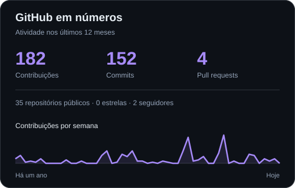
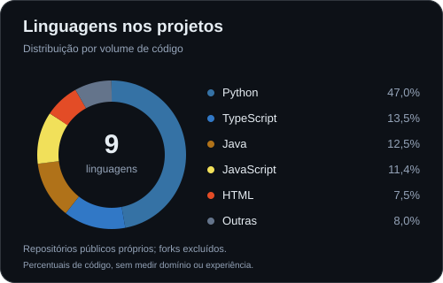
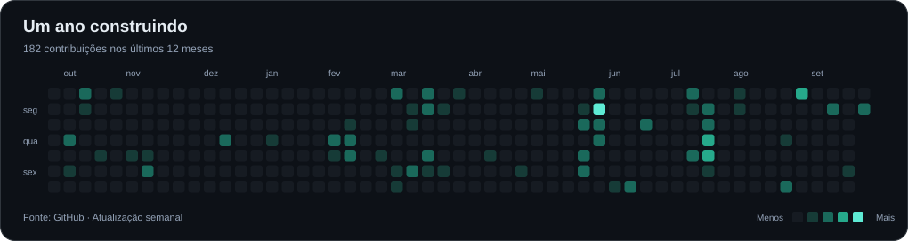

<!-- Header based on readme-ai v0.6.3 COMPACT, adapted for a GitHub profile. -->

# Luiz Amaral

**Dev Full Stack na FluxoMind · Aplicações com IA**

 

---

### O que eu faço

Sou desenvolvedor Full Stack na **FluxoMind**, onde trabalho com aplicações e fluxos baseados em inteligência artificial. Conecto interfaces, APIs, bancos de dados e agentes para automatizar processos.

Meu foco está em **Full Stack com IA**: sistemas agênticos com **LangGraph**, pipelines de **RAG**, embeddings e recuperação semântica. Também desenvolvo com **Java, Spring Boot, TypeScript e Node.js**.

### Projeto em destaque · WebCars

**[Conheça o código →](https://github.com/lzAmaral/FluxoMind_WebCars)**

Desenvolvi todas as partes do WebCars: uma aplicação de veículos com catálogo, filtros, comparação, assistente de IA, captura de leads e painel administrativo.

- **Full Stack:** interface em Next.js, API em Express e banco PostgreSQL.
- **IA com contexto:** pipeline RAG com embeddings e pgvector para consultar informações do catálogo e apoiar as respostas do assistente.
- **Experiência de conversa:** trabalhei no system prompt para tornar as respostas mais diretas; respostas longas eram um dos desafios do projeto.
- **Fluxo completo:** da descoberta de um veículo à captura de interesse e gestão de leads.

Next.js · TypeScript · Node.js · Express · PostgreSQL · pgvector · Gemini

### Outros projetos

**[Mercado Tech Brasil](https://github.com/lzAmaral/caged-etl-analytics)** — Pipeline ETL e dashboard para explorar salários e contratações de TI com dados do Novo CAGED. 
Java · Spring Boot · Spring Batch · PostgreSQL · Chart.js

**[Blog API](https://github.com/lzAmaral/blog-backend)** — Publicação de artigos com autenticação JWT, upload de imagens e controle de autoria. 
Node.js · TypeScript · Express · MySQL

### Tecnologias

**Aplicações**

**IA, dados e ferramentas**

### GitHub em gráficos

  
  

Dados do GitHub atualizados semanalmente. Linguagens por volume de código em repositórios públicos próprios, sem forks.

---

[Mais projetos no GitHub](https://github.com/lzAmaral?tab=repositories) · [Meu portfólio](https://luizamaral.vercel.app/) · [Vamos conversar](https://www.linkedin.com/in/luiz-amarall/)
